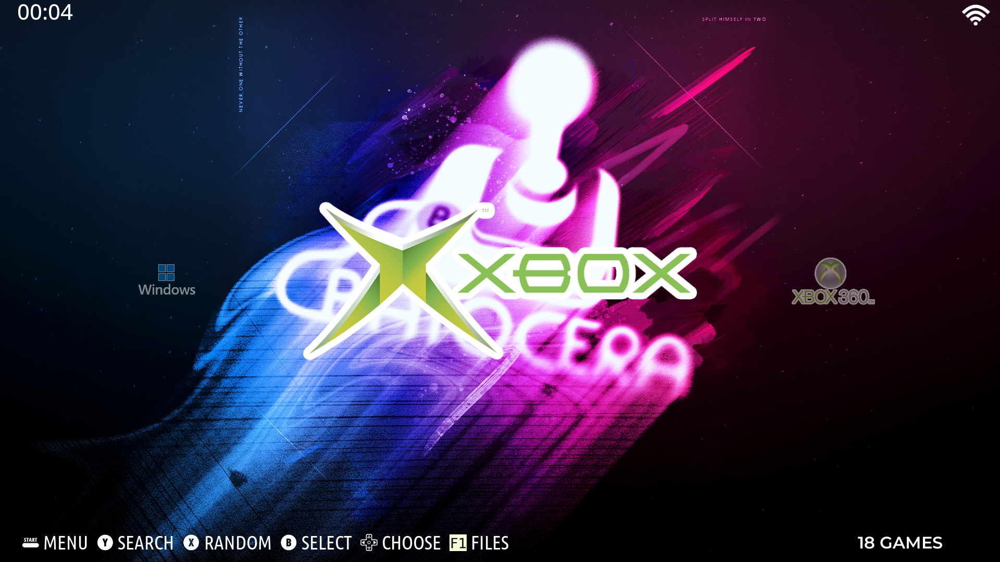
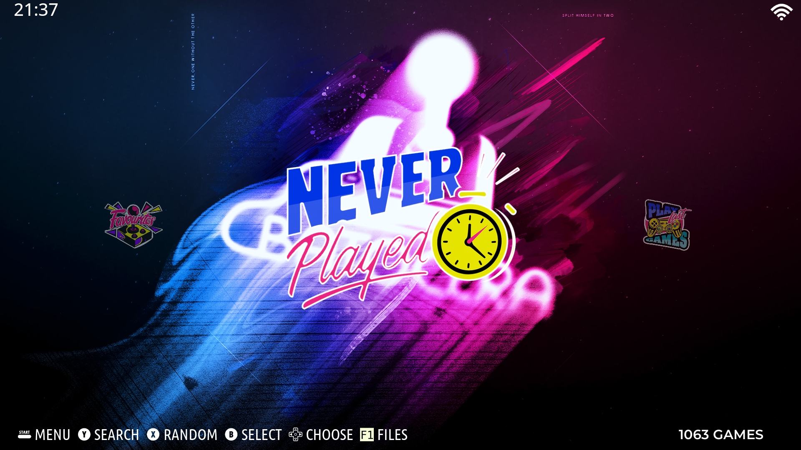
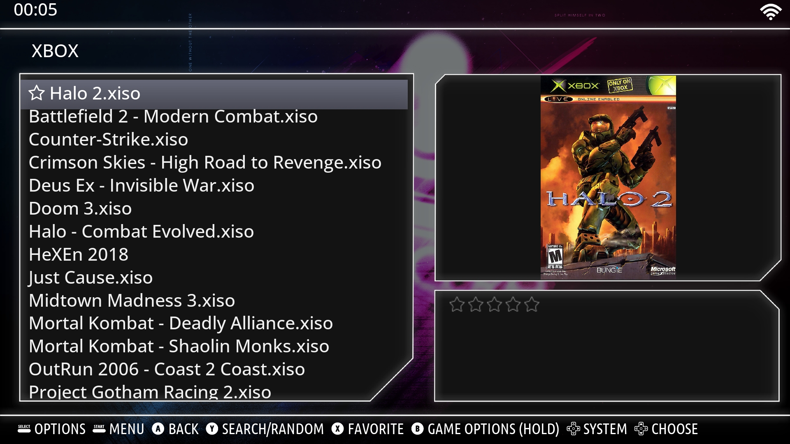
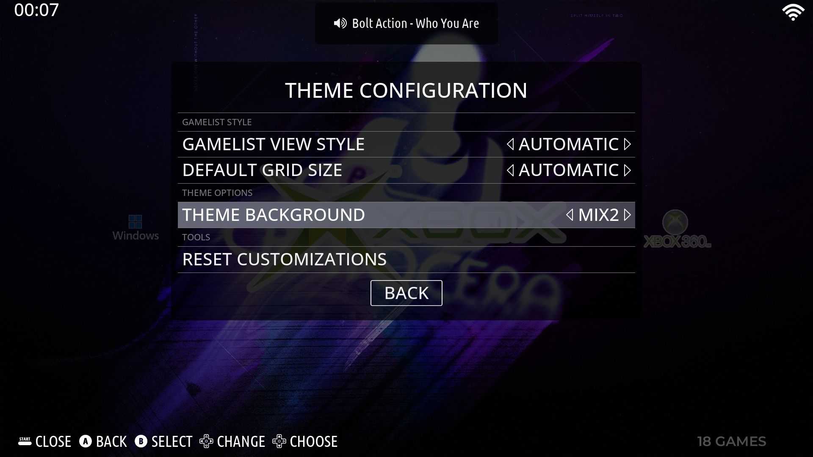
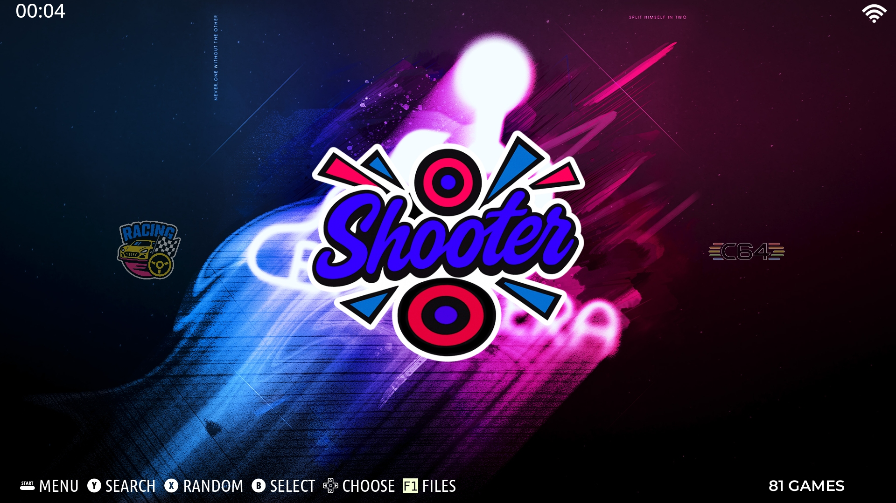

# Pulse Theme for RetroBat

RetroBat compatibility adaptation of the **Batocera Pulse Theme** by **complicatiion / sksdesign / sven404**, based on **ES-A-StarWars-Theme** by **soaremicheledavid (SMD)**.

## Purpose

This package adapts the existing Pulse Theme XML and documentation for **RetroBat on Windows** while retaining the original artwork, layouts, fonts, sounds and theme structure.

RetroBat uses a Windows build of `batocera-emulationstation`, so most Batocera theme syntax is directly compatible. The adaptation focuses on properties and XML details that are either invalid, inconsistent or unnecessary in the current parser.

## Previews








## Installation

## Recommended: Manual Installation

Download Complete package and place it in RetroBat Themes Folder.

### Alternative: installer script

1. Extract this compatibility package.
2. Open PowerShell.
3. Run:

```powershell
.\tools\Install-Pulse-RetroBat.ps1 -RetroBatRoot "D:\RetroBat"
```

The script downloads the public upstream Pulse Theme, copies all original assets and then overlays the RetroBat-adjusted XML and documentation.

If you already have the Batocera Pulse Theme locally, use:

```powershell
.\tools\Install-Pulse-RetroBat.ps1 -RetroBatRoot "D:\RetroBat" -SourceThemePath "C:\Themes\batocera_pulse_theme"
```

The resulting theme is installed to:

```text
<RetroBat>\emulationstation\.emulationstation\themes\Pulse-RetroBat\
```

Then select it in RetroBat under:

**Main Menu → UI Settings → Theme Set**

### Manual installation

1. Download or clone the original Pulse Theme repository.
2. Copy the full theme to:
   `<RetroBat>\emulationstation\.emulationstation\themes\Pulse-RetroBat\`
3. Overwrite `theme.xml` and `theme2.xml` with the files from this package's `overlay` folder.
4. Keep `_res`, `art`, `assets`, `layouts`, `preview` and `splash` from the original theme.
5. Restart EmulationStation or reload the theme.

## RetroBat compatibility changes

- Retained `<formatVersion>7</formatVersion>`.
- Retained `controllerActivity`: supported by the current Batocera/RetroBat EmulationStation theme parser.
- Retained `batteryIndicator`: supported by the current parser, including battery and network icon paths.
- Removed `scrollSound` from `menuText`, because it is not a supported `menuText` property in the current parser.
- Kept `scrollSound` for `textlist` and `carousel`, where it is supported.
- Fixed duplicate background subset IDs: `MIX9.xml` and `MIX10.xml` now use `mix9` and `mix10` instead of duplicate `mix7` / `mix8` names.
- Corrected the grid metadata element `md_rating` from `<text>` to `<rating>`.
- Removed the redundant `ifSubset="system-view-style:centered-one-logo"` `maxLogoCount` line because this theme does not define that subset and both values were identical.
- Kept forward-slash relative paths. They are portable and are the normal EmulationStation theme path format on Windows as well.
- Updated installation documentation from Batocera `/userdata/themes/` to the RetroBat theme directory.

See `docs/RETROBAT_COMPATIBILITY.md` for the detailed audit.

## Theme variants

- `theme.xml`: original gray accent profile.
- `theme2.xml`: original purple accent profile.

RetroBat loads `theme.xml`. To use the purple profile, back up `theme.xml` and copy/rename `theme2.xml` to `theme.xml`.

## Original Pulse Theme features

- Dark modern layout
- Custom icon set
- 10 MIX wallpapers
- Multiple gamelist backgrounds
- Basic, Detailed and Grid views
- 16:9 and 4:3 layouts
- Custom fonts and sounds

## Runtime note

The XML has been syntax-validated and audited against the current Batocera/RetroBat EmulationStation theming implementation. A final visual runtime test inside your specific RetroBat build is still recommended because available systems, controller/battery telemetry and theme rendering can vary between RetroBat releases and Windows hardware.

## Source / Credits

Original Pulse Theme repository:
`https://github.com/complicatiion/batocera_pulse_theme`

Original theme base:
`https://github.com/soaremicheledavid/ES-A-StarWars-Theme`

RetroBat:
`https://www.retrobat.org/`

## License

The original license is preserved in `LICENSE.md`. The RetroBat compatibility adaptation does not change the original asset licensing or attribution requirements.
